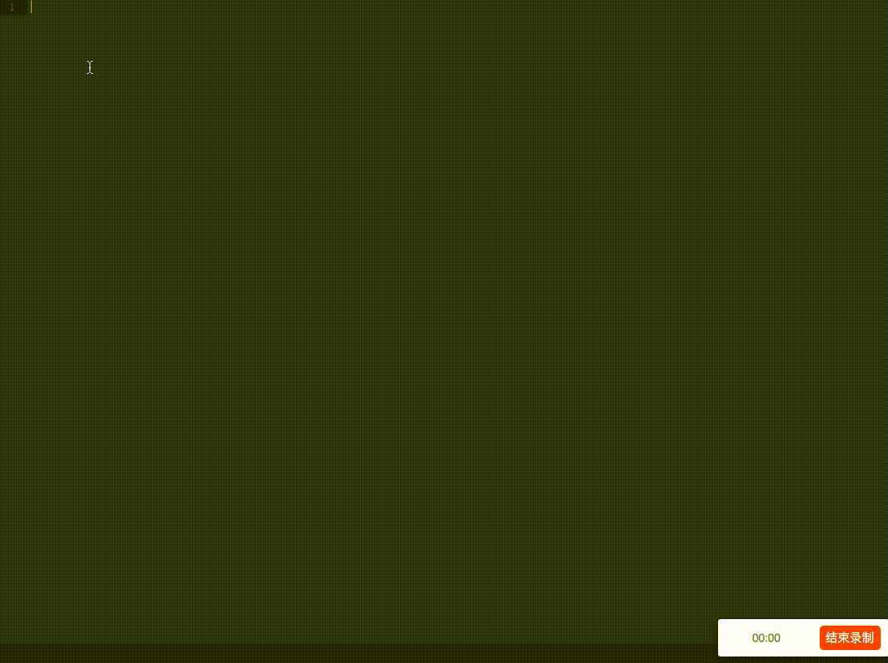

# WDML Markup - Sublime Plugin

A sublime plugin complete with WonderTek WRP engine.



Fell free to let me know what else you want added via:

- Email : liangzr@outlook.com
- [Issues](https://github.com/liangzr/wdml-markup/issues)

## Feature

- wdml tag auto-complete with properties
- lua apis auto-complete

## What's included - contents

- [Installation](#installation)
- [Usage](#usage)
- [Component](#component)
- [Snippet](#snippet)
- [Dependency](#dependency)
- [License](#license)

### Installation

##### Step 1
Download `zip` file or clone to your disk.

```
git clone https://github.com/liangzr/WDMLMarkup.git
```

##### Step 2
Move package to Sublime Text 3's Package folder

for Windows is: 

```
C:\Users\<USER NAME>\AppData\Roaming\Sublime Text 3\Packages\
```

### Usage

Configure you libraries at  `Preferences -> Package Settings -> WDMLMarkup -> Setting - User `

```
{
	// default libraries
	"default\_library\_path":[
		"D:\\bin\\module\\com\_listencp\_client",
		"D:\\bin\\framework"
	],
	// load opened folders, set "true" to enable.
	// warnning: if you opened a folder that have many files, Sublime Text 3 maybe stuck in index!
	"load\_opened\_folder": "false"
}
```

### Component

##### General Tag

| keyword         | properties                               |
| :-------------- | :--------------------------------------- |
| node            | name, rect, visible, active, enable, mushroom, autofocus, frame, transparent, layouttype, border, top-float, data, class, font-family, font-size, font-style, font-auto, css, critical-sertion, resolution, extendstyle, margin, box, type, grid-col, padding, scroll, scrollbar\_body, scrollbar\_slider, PreBuildChildren, BuildChildrenFinished, PrePropertySetting, PropertySettingFinished, OnKeyDown, OnKeyUp, OnKeyLongPress, OnMouseDown, OnMouseLongPress, OnGestureBegin, OnGestureMove, OnGestureEnd, OnDualDown, OnDualUp, OnDualMove, OnTouchEvent, OnGestureSingleLeft, OnGestureDoubleRight, OnTick, OnSetFocus, OnLostFocus, OnSetEnable, OnSetVisible, OnSetActive, OnSpriteEvent, OnPluginEvent |
| checkbox        | text, h-align, v-align, color, normal, sel, checked, focus, disabled, sel-focus, checked-focus, checked-disabled, selected, silent, OnSelect, OnDbClick, OnChecked |
| image           | src, dftsrc, style, alpha, bodyalpha, rotate, sudoku, src\_rect, animate-to, disp, alphaeffect, dithereffect, inverteffect, corner, sight, sightoption, src, style, src\_size, rotate, OnSightMove, OnDbClick |
| radio           | text, h-align, v-align, color, normal, sel, checked, focus, disabled, sel-focus, checked-focus, checked-disabled, selected, silent, OnSelect, OnDbClick |
| combobox-item   | defaultFocusName, sort, expand, float, poker, adjustbychild, drag, OnStatusChanged, normal, sel, disp, src, style, text, h-aligh, v-aligh, color |
| chart1b         | mode-clip, mode-zip, color-normal, color-heilight, color-gray, img-normal, img-highlight, img-gray, img-indicator-top, img-indicator-bottom, img-clamp-left, img-clamp-right, baseline, color-baseline, color-background, alpha-background, cell-bar, indicator-bar, clamp-size, touch-area, indicator-touch, OnChart1bTouch, OnChart1bClick |
| group           | selected, OnSelectChanged                |
| combobox        | text, h-align, v-align, color, normal, sel, checked, focus, disabled, sel-focus, checked-focus, checked-disabled, selected, silent, OnSelect, OnDbClick, dragdown-rc, display-rc, selected, sort-style, scrollbar, OnSelectChanged |
| window          | bodyalpha                                |
| sub-item        |                                          |
| animate-frame   | start, delay                             |
| globe-item      | text, autoextend, postfix, h-align, v-align, color, shadow, shadow-color, shadow-alpha, shadow-offset, normal-font-size, normal-color, final-color, OnSelect, OnFocus, OnLostFocus |
| gauss           | quality, light                           |
| shadow          | color, alpha, bodyalpha                  |
| gf-item         | src, dftsrc, text, OnSelect, OnFocus, OnLostFocus |
| edit            | text, autoextend, postfix, h-align, v-align, color, shadow, shadow-color, shadow-alpha, shadow-offset, option, title, max-size, multiline, password, direction, autoup, src\_paste, rect\_paste, src\_cut, rect\_cut, returntype, OnKeyboardSizeChanged, OnTextChanged, OnUrl |
| button          | text, h-align, v-align, color, normal, sel, checked, focus, disabled, sel-focus, checked-focus, checked-disabled, selected, silent, OnSelect, OnDbClick |
| list            | col, line, current, start, auto-adjust, no-adjust, offset, drop-mode, drop-bcopy, drag-trigger, drop-trigger, drop-animate-delay, OnEdgeEvent, OnDrag, OnDragging, OnDrop, OnDropRelease |
| chart1          | style, color, src, indicator, x-axis, y-axis, averageline, average-color, y-style, x-unit, y-unit, chart-data, axis-font-family, axis-font-size, axis-font-sytle, text-color, axis-text-color, axis-line-color, grid-line-color, grid-bg-color, axis-org, cell-bar, animate-delay, line-width, fill-alpha, OnChart1Touch |
| panoramaitem    | navigation\_1, navigation\_r, navigation\_auto, navigation\_fold, preview, preview\_reduce, OnSelect, OnNavigationL, OnNavigationR, OnNavigationC, OnMoveNavigation |
| list-item       | defaultFocusName, sort, expand, float, poker, adjustbychild, drag, OnStatusChanged |
| scrollbar       | bar, style, pos, max-size, splider, OnPageUp, OnPageDown |
| lyric           | text, normal-color, focus-color, step-color, font-step, line-height, offset, percent, select, step |
| listview        | limit, sort, foreground, antenna, speed-layer, OnTrail, OnHead, OnOverTrail, OnOverHead, OnDrag, OnDrop, OnMoveList |
| image-editor    | src, dftsrc, style, alpha, bodyalpha, rotate, sudoku, src\_rect, animate-to, disp, alphaeffect, dithereffect, inverteffect, corner, sight, sightoption, src, style, src\_size, rotate, OnSightMove, OnDbClick, src, filter, mask, merge, touch-area, touch-arrow, clipsize, clip-keep |
| datepicker      | text, h-align, v-align, color, normal, sel, checked, focus, disabled, sel-focus, checked-focus, checked-disabled, selected, silent, OnSelect, OnDbClick, style, date, sunday, calendar-color, weekend-color, calendar-bg, calendar-rc, display-rc, OnSelectChanged |
| coverflow-item  | src, dftsrc, text, OnSelect, OnFocus, OnLostFocus |
| clip            | start-angle, sweep-angle                 |
| tree            | direction, offset, h-leading, v-leading, leading-width, multisel, OnMoveTree |
| globe           | final-scale, style, tick-mark-color      |
| surface         | style                                    |
| animate         | loop, delay                              |
| calendar        | style, date, sunday, color, weekend-color, OnSelectChanged |
| canvas          | color, bg-color, brush-diameter          |
| label           | text, autoextend, postfix, h-align, v-align, color, shadow, shadow-color, shadow-alpha, shadow-offset |
| treeitem        | normal, sel, disabled, open, close, expand, autoselect, OnExpand, OnSelect |
| gatefold        | moon, rotate, focus-size, spacing        |
| gallery-item    | normal, middle, focus, OnSelect, OnFocus, OnHold, OnLost |
| textedit        | text, model, color, line-height, top, step, roll, autoextend, mov, wrap, h-align, v-align, OnUrl |
| coverflowv-item | OnSelect, OnFocus, OnLostFocus           |
| gallery         | spacing, normal-size, middle-size, focus-size, foreground, mode, sort, OnSelect |
| coverflowv      | focus-size, focus-indent, normal-indent, single-step |
| coverflow       | normal-size, focus-size, rotate, focus-indent, normal-indent, text-color, limit, single-step, scaling |
| textarea        | text, color, line-height, line-dis, top, step, maxlines, loop, right2left, autoextend, minheight, v-center, h-align, shadow, shadow-color, shadow-alpha, shadow-offset, copy\_paste, src\_checkall, rect\_checkall, src\_startpoint, src\_endpoint |
| mazelock        | cell-default, cell-highlight, cell-margin, cell-size, band-color, band-alpha, band-width, touch-area, visit, OnComplete |
| panorama        | background, sort, foreground, navigation\_auto, style, alpha, pos, OnMovePanorama, OnTrail, OnHead, OnJoinItem |

##### Fast Completion List

| tag          |
| :----------- |
| node         |
| shadow       |
| image        |
| button       |
| label        |
| panorama     |
| panoramaitem |

### Snippet

| keyword | description                      |
| :------ | :------------------------------- |
| wdml    | a basic wdml templete            |
| bri     | add comments                     |
| logs    | print string log                 |
| logv    | print value log                  |
| newb    | add a seprate line for new block |

### Dependency

- WRP Engine \- 3.2.0 (not limited, but necessary)
- Sublime Text 3

### License

[GPL-3.0](README.md)
